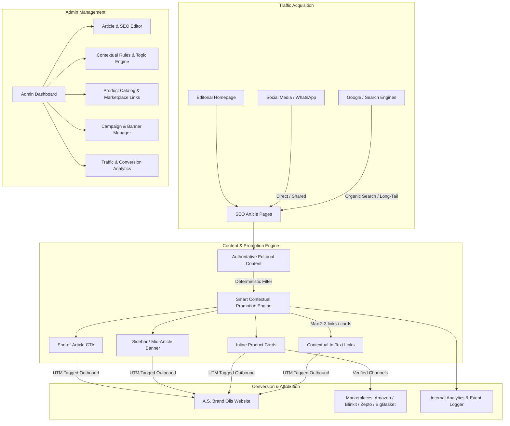

# Architecture & Implementation Plan: SEO Content Platform with A.S. Brand Oils Contextual Promotion Engine

Build a modern, production-grade, editorial content publishing platform (Next.js 14+ App Router, TypeScript, Prisma ORM, TailwindCSS/Vanilla CSS) that prioritizes high organic search ranking, editorial readability, and an intelligent, non-intrusive contextual promotion system for **A.S. Brand Oils**.

---

## User Review Required

> [!IMPORTANT]
> - **Database Choice**: We will configure Prisma ORM with **SQLite** for instant, zero-setup local development and seamless portability, while maintaining full structural compatibility with **PostgreSQL**.
> - **Brand Balance**: The platform is architected first and foremost as a genuine, authoritative digital publication (food, recipes, health, agriculture, culture). A.S. Brand Oils integrations are strictly controlled (2–3 stable contextual mentions, elegant inline cards, sidebar widgets, and end-of-article CTAs) to maintain high trust and avoid search engine spam penalties.
> - **Official Product Roster**: Pre-populated with the 6 verified A.S. Brand products and high-resolution CDN assets from `asbrandoils.com`, plus admin controls for adding marketplace links (Amazon, Blinkit, Zepto, BigBasket, Instamart).

---

## Architecture Overview

---

## Proposed Changes

### 1. Project Initialization & Foundation
- Setup Next.js App Router project with TypeScript, Tailwind CSS, Lucide icons, `@prisma/client`, and `sanitize-html`.
- Setup custom typography (`Playfair Display` + `Outfit` / `Inter`) and design tokens (warm editorial cream `#FAFAF7`, rich forest emerald `#133E2A`, warm gold `#D97706`, charcoal `#1C1917`).

### 2. Database Schema (`prisma/schema.prisma`)
- **`User`**: Admin users, roles, password hashes.
- **`Author`**: Bio, avatar, social handles, slug.
- **`Category` & `Subcategory`**: Hierarchical taxonomies with SEO metadata.
- **`Tag`**: Content tagging for cross-cutting topic clusters.
- **`Article`**: Title, slug, excerpt, content (HTML/JSON), featured image, reading time, SEO fields (title, desc, canonical, focus keywords, OG images), status (DRAFT, PUBLISHED, SCHEDULED), structured FAQ/How-to arrays, view count.
- **`Product`**: A.S. Brand product database (title, slug, short desc, long desc, CDN image, product URL, marketplace links JSON, tags).
- **`PromotionRule`**: Topic keywords, priority, target product ID, placement types (CONTEXT_LINK, INLINE_CARD, BANNER, END_CTA), category exclusions/inclusions, max links per article.
- **`Campaign`**: Name, banner image, CTA text, destination URL, start/end dates, active status.
- **`AnalyticsEvent`**: Event type (`article_view`, `product_click`, `contextual_link_click`, `banner_click`, `outbound_asbrand_click`), article ID, product ID, campaign ID, placement, UTM params, referrer, user agent, timestamp.
- **`SEOSetting` & `Redirect`**: Global SEO defaults, robots settings, 301/302 redirects.

### 3. Smart Contextual Promotion Engine (`lib/promotion-engine.ts`)
- **Deterministic Placement Algorithm**:
  - Scans article content paragraphs (ignoring `<h1>`-`<h6>`, `<a>`, `<blockquote>`, `<code>`, `<figcaption>`).
  - Matches configured `PromotionRule` keywords against topic tokens.
  - Limits links to maximum 2–3 per article.
  - Ensures minimum paragraph distance (e.g. at least 2 paragraphs between promotional elements).
  - Generates stable, deterministic HTML transformation cached per article publish state (avoiding layout shifts and SEO crawler inconsistency).
  - Appends proper UTM parameters automatically (`utm_source=content_platform`, `utm_medium=contextual_link`, `utm_campaign=...`, `utm_content=...`).

### 4. Technical SEO Architecture
- **Dynamic Metadata Generator** (`app/[category]/[slug]/page.tsx`):
  - Complete OpenGraph and Twitter cards.
  - Canonical URLs with duplicate-content defense.
  - JSON-LD Structured Data: `Article`, `BreadcrumbList`, `Organization`, `FAQPage`, and `Product` review schemas.
- **Robots & Sitemap**:
  - Dynamic `app/sitemap.ts` generating full index of articles, categories, authors, and images.
  - Dynamic `app/robots.ts` with crawl rules.
- **Semantic HTML & Core Web Vitals**:
  - Strict heading hierarchy (`h1` -> `h2` -> `h3`), WebP/AVIF responsive image optimizations with explicit aspect ratios, zero CLS (Cumulative Layout Shift).
- **Topic Clustering & Internal Linking Engine**:
  - Automatic pillar page -> subtopic cross-linking recommendations.

### 5. Public Magazine Front-End
- **Header & Navigation**: Mega menu categories, search overlay, trending badge, brand transparency notice.
- **Editorial Homepage**:
  - Hero featured story & trending grid.
  - Category sections: Food & Recipes, Cooking Science & Smoke Points, Health & Wellness, Traditional Culture & Deepam Rituals, Agriculture & Business.
  - Editorial Spotlight & Recipe of the Week.
  - Subtle brand story banner ("Purity rooted in South Indian tradition").
  - Newsletter subscription.
- **Article Reading View**:
  - Breadcrumbs, clean typography, reading progress bar, author box, publish/updated timestamps.
  - Rich content rendering with embedded contextual links, inline product cards, recipe cards, FAQs accordion, mid-article posters, and high-converting End-of-Article CTA.
  - Non-intrusive desktop sidebar with "Featured South Indian Essentials" product widget.
  - "Where to Buy" marketplace badges (Amazon, Zepto, Blinkit, BigBasket, Instamart).
  - Related articles topic cluster.
- **Category & Tag Pages**: Paginated, filterable grid with category descriptions and SEO headers.
- **Search Page**: Instant debounced full-text search across articles, categories, and tags.
- **Marketplace & Products Discovery Page**: Dedicated editorial showcase of A.S. Brand Oils with genuine cooking guides and verified purchase links.

### 6. Admin Management Suite (`/admin`)
- **Dashboard Overview**: Article counts, daily views, CTR on promotional links, outbound conversions to `asbrandoils.com`, top clicked products.
- **Article Manager**:
  - Block/Rich-text editor with instant preview.
  - Real-time **Live SEO Auditor** (scores title length, meta description, heading structure, focus keyword density, image alt text, internal link count, promotional link count).
  - Promotion Preview toggle (inspect how contextual links and inline cards look before publishing).
- **Contextual Promotion Rules Manager**:
  - Add/edit keyword triggers (e.g. `sesame oil`, `gingelly oil` -> A.S. Brand Hulled Gingelly Oil).
  - Adjust max links per article, placement slots, and campaign overrides.
- **Product & Marketplace Manager**:
  - Manage products, upload/update images, edit direct URLs and verified marketplace links.
- **Campaign & Banner Manager**:
  - Create seasonal/festival promotional banners (e.g., Karthigai Deepam, Diwali, Pongal Cooking).
- **Analytics & Outbound Tracker**:
  - Real-time event log with filters by article, product, UTM campaign, and placement.
- **SEO & Redirects Manager**:
  - Manage 301/302 redirects, global meta tags, and robots directives.

---

## Verification Plan

### Automated & Build Verification
1. `npm run build`: Verify TypeScript compilation, static site generation, and route manifests with 0 errors.
2. Database Seed: Populate with comprehensive high-quality articles (Food, Cooking Science, Health, Deepam Traditions, Agriculture), full category tree, and all 6 official A.S. Brand products.
3. Sitemap & RSS Check: Validate dynamic `/sitemap.xml` and `/robots.txt` format and status codes.

### Functional & SEO Verification
1. **Contextual Engine Testing**:
   - Verify articles about Gingelly Oil automatically and deterministically render 2-3 links with tooltips and 1 inline product card.
   - Verify un-related articles (e.g. general tech/business) do NOT receive forced oil promotions.
   - Verify headings and existing links are never hyperlinked.
2. **UTM & Outbound Tracking**:
   - Click outbound links and verify UTM parameters are correctly attached (`utm_source`, `utm_medium`, `utm_campaign`, `utm_content`).
   - Check Admin Analytics to ensure click events are recorded with proper device/placement tags.
3. **Structured Data Validation**:
   - Inspect JSON-LD output in HTML head to ensure valid Schema.org format for `Article` and `BreadcrumbList`.
4. **Admin Workflow**:
   - Test creating a new article with SEO tags, previewing promotional placements, adjusting context rules, and publishing.
